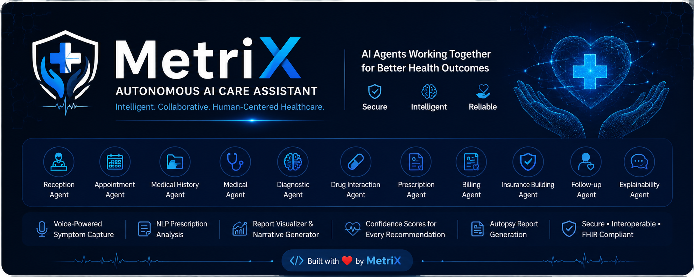
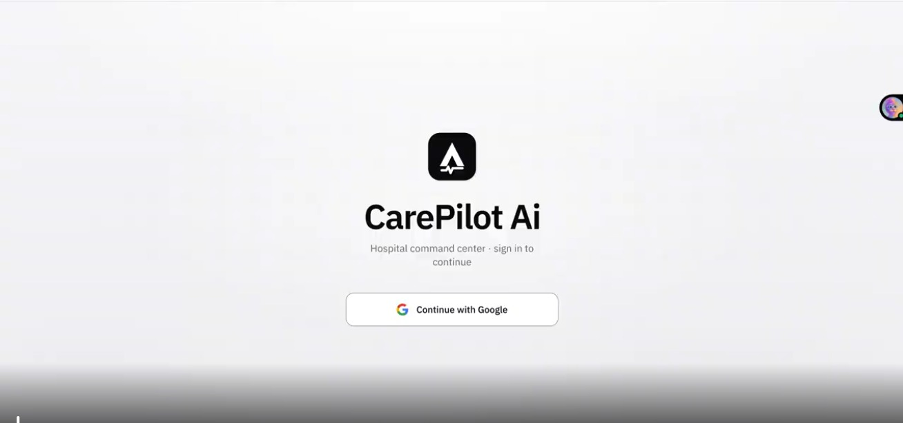
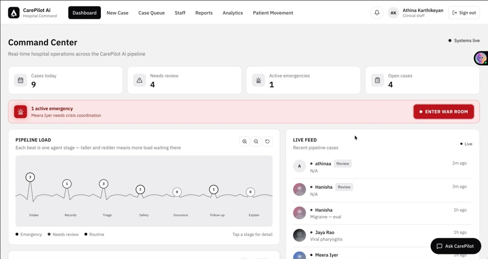
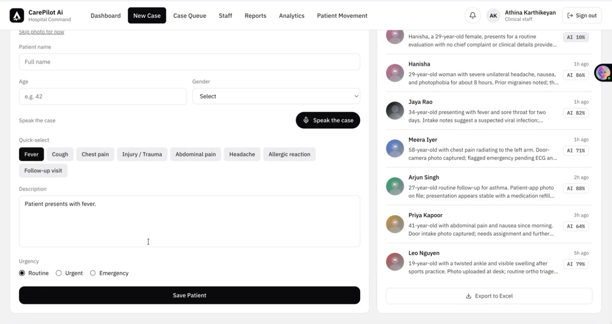
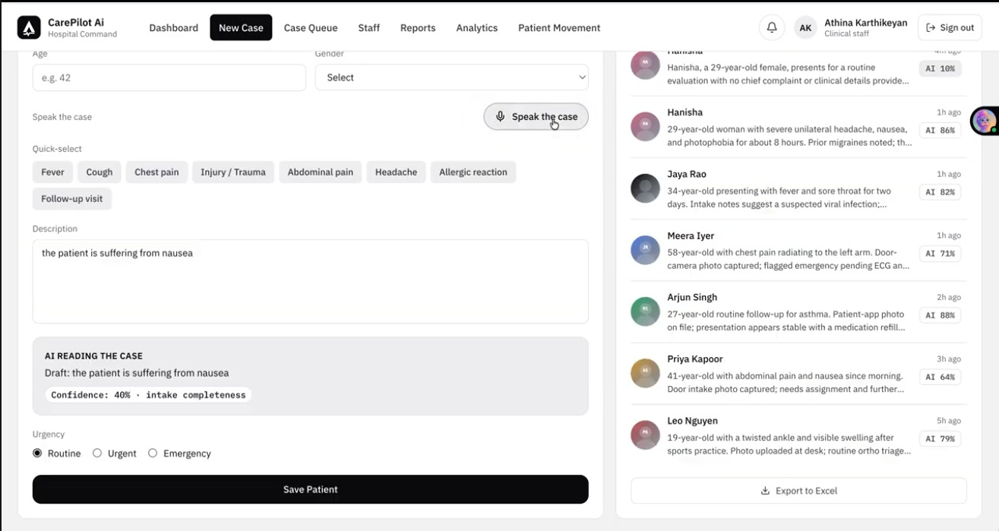
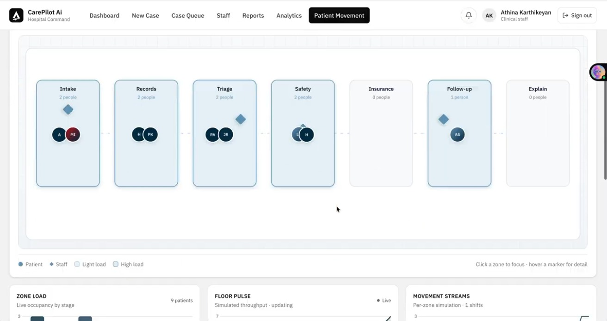
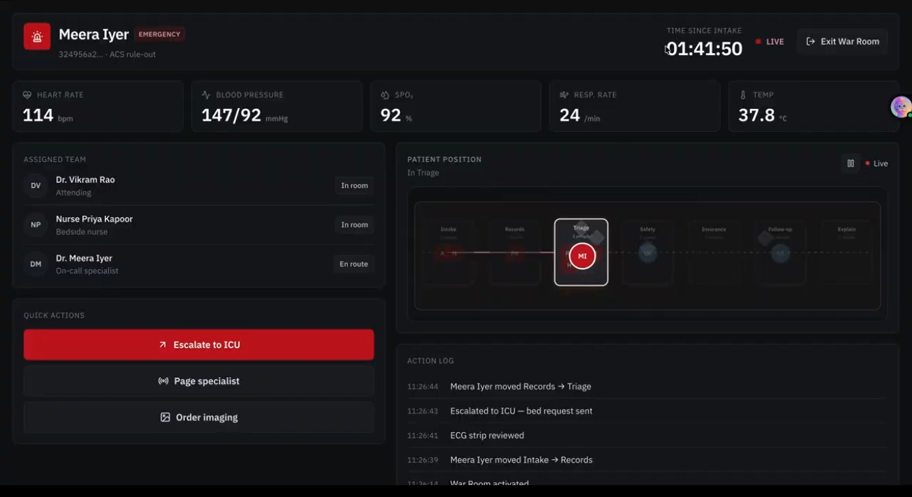
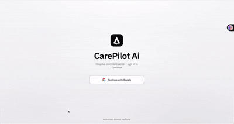
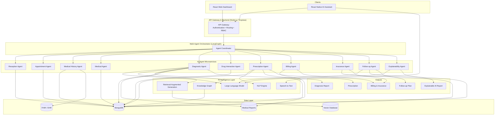
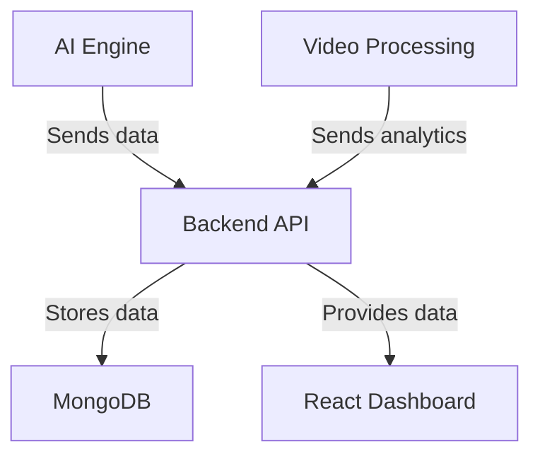

# CarePilot AI: Multi-Agent AI Care Assistant

 

## Team Title

**MetriX**  
**[ Chennai Institute Of Technology ]**

### Contributors

- **[Hanisha Govindaraj](https://github.com/Hani-Govind)** - Mobile Application & Team Lead
- **[B.K ATHINA](https://github.com/Athina09)** - Frontend Development
- **[NITHEESH S](https://github.com/nitheeshcitbecse-eng)** - Backend Development
- **[VIPUL RAJ SHAH](https://github.com/vips725)** - AI Engineering 
- **[ROSHAN PATEL](https://github.com/Roshan-Metrix)** - Research, Documentation & Technical Writing

<a href="https://github.com/MediaTrex/Codefest-2.0-Hackathon/graphs/contributors">
  
</a>

## Project Screenshots

### CarePilot AI - Complete UI Overview

<table>
  <tr>
    <td align="center"><br></td>
    <td align="center"><br></td>
    <td align="center"><br></td>
  </tr>
  <tr>
    <td align="center"><br></td>
    <td align="center"><br></td>
    <td align="center"><br><strong><a href="./assets/screenshots/web">more..</a></strong></td>
  </tr>
</table>

<p align="center">
  <em>Autonomous AI Care Assistant using Multi-Agent Systems</em>
</p>


---

## 🩺 Problem Statement & Research Insights

### **The Challenge**

Modern healthcare systems depend on multiple disconnected applications for patient registration, appointment scheduling, electronic health records (EHR), diagnosis support, prescription management, laboratory reports, insurance processing, billing, and follow-up care. These isolated systems create fragmented workflows that reduce efficiency and impact the quality of patient care.

Key challenges include:

- **Fragmented Healthcare Data** – Patient information is scattered across multiple systems, making it difficult for clinicians to access a complete medical history.
- **Delayed Clinical Decision-Making** – Doctors spend valuable time gathering records, reports, and previous diagnoses before making informed decisions.
- **High Administrative Workload** – Manual handling of appointments, documentation, billing, insurance claims, and follow-up consumes significant healthcare resources.
- **Medication Errors & Drug Interactions** – Prescriptions may contain harmful drug interactions, contraindications, duplicate medications, or incorrect dosages without intelligent verification.
- **Limited Trust in AI Systems** – Many AI healthcare solutions provide recommendations without explaining *why*, reducing clinician confidence and adoption.
- **LLM Hallucinations** – Large Language Models can generate inaccurate or unsupported medical advice if not grounded in trusted clinical knowledge.
- **Poor Continuity of Care** – Patients often miss follow-up appointments, medication schedules, and recovery monitoring after treatment.
- **Complex Insurance & Billing** – Insurance verification and billing workflows are often slow, manual, and error-prone.
- **Unstructured Medical Documents** – Clinical notes, laboratory reports, imaging reports, and handwritten prescriptions are difficult to analyze efficiently.

---

### Global Context (2025–2026)

Healthcare systems worldwide are rapidly adopting **Artificial Intelligence**, **Large Language Models (LLMs)**, and **Clinical Decision Support Systems (CDSS)** to improve patient outcomes and hospital efficiency.

Recent research emphasizes:

- **Retrieval-Augmented Generation (RAG)** to reduce hallucinations by grounding AI responses with trusted medical knowledge.
- **Explainable AI (XAI)** to ensure healthcare professionals understand the reasoning behind AI-generated recommendations.
- **FHIR & HL7 Standards** to enable secure interoperability between hospitals, laboratories, pharmacies, and insurance providers.
- **Multi-Agent AI Systems** that allow specialized AI agents to collaborate and automate complex healthcare workflows while keeping humans in control.

---

## Our Solution

We propose an **Autonomous AI Care Assistant** powered by a **Multi-Agent System (MAS)**, where multiple specialized AI agents collaborate as independent microservices to assist healthcare professionals and patients throughout the entire healthcare journey.

### Core Capabilities

- Multi-Agent AI Architecture for intelligent task collaboration
- Large Language Models (LLMs) for clinical reasoning
- Retrieval-Augmented Generation (RAG) for evidence-based recommendations
- Knowledge Graphs for medical relationship modeling
- LangGraph for AI agent orchestration
- FHIR-compliant interoperability with hospital systems
- Voice-based symptom collection using Speech-to-Text + NLP
- AI-powered understanding of medical reports, lab results, MRI, CT scans, and prescriptions
- NLP-based prescription analysis with dosage and drug extraction
- Drug interaction and contraindication detection
- Explainable AI with confidence scores for every recommendation
- Intelligent patient follow-up and recovery monitoring
- Automated insurance verification and billing assistance
- Clinical narrative generation from patient history and reports
- Structured autopsy report generation and postmortem documentation

---

###  Impact

Our system is **not designed to replace healthcare professionals**. Instead, it serves as an intelligent clinical assistant that:

- Improves clinical decision-making
- Reduces administrative workload
- Enhances patient engagement
- Minimizes medical errors
- Provides transparent and explainable AI recommendations
- Enables evidence-based, personalized healthcare
- Improves operational efficiency across healthcare organizations
---

## Project Demo



## Live Demo

[CarePilot AI Demo Video link](https://drive.google.com/file/d/1R3agz3OKhA4Wml6yTrUIiPG49TDdf9kc/view?usp=drive_link)

## How to Run
```bash
# 1. Copy example env and fill in your keys
cp .env.example .env

# 2. Start all services
docker-compose up -d

# 3. Check logs
docker-compose logs -f
```

---

## Tech Stack & Reasoning

| Component       | Technology                  | Why We Chose It |
|-----------------|-----------------------------|-----------------|
| **Backend**    | **Nodejs/Expressjs**                | Excellent AI integration, native async support, built-in Swagger docs, Python ecosystem, and fastest hackathon development speed. Superior to Express for AI-heavy workloads. |
| **Frontend**   | **ReactJS**                | Fast, component-based UI for interactive dashboards, heatmaps, and real-time updates. |
| **Database**   | **MongoDB & VectorDB**                | Flexible schema for storing anonymized analytics, heatmaps, and alerts. Perfect for FARM stack scalability. |
| **AI Engine**  | **LLM** + **Agents** + **RAG** | RAG to reduce hallucinations by grounding AI responses with trusted medical knowledge |
| **App Development** | ReactNative + Axios | Fast development and robust library. |
| **Deployment** | Docker (recommended)       | Easy reproducibility and scalability. |

**Why this stack?** It aligns perfectly with your architecture decision — **AI-heavy**, rapid prototyping in 48 hours, and production-ready.

---
## System Architecture & Data Flow


### Overview:


## System Workflow

1. **Patient Access**
   - Patient logs in through the **React Web Dashboard** or **React Native AI Assistant**.
   - Authentication and authorization are handled by the API Gateway.

2. **Patient Registration & Reception**
   - The **Reception Agent** registers new patients or retrieves existing patient profiles.
   - Basic demographic information and visit details are collected.

3. **Appointment Scheduling**
   - The **Appointment Agent** checks doctor availability.
   - Books, reschedules, or cancels appointments.
   - Sends appointment confirmations and reminders.

4. **Symptom Collection**
   - Patients describe their symptoms using text or voice.
   - Voice input is converted into text using **Speech-to-Text (STT)**.
   - The **NLP Engine** extracts structured symptoms and medical entities.

5. **Medical History Retrieval**
   - The **Medical History Agent** fetches previous diagnoses, allergies, medications, surgeries, laboratory reports, and Electronic Health Records (EHR).
   - Patient history is summarized for quick clinical review.

6. **Medical Report Analysis**
   - Patients or clinicians upload medical documents such as:
     - Blood reports
     - MRI/CT Scan reports
     - X-rays
     - Laboratory reports
     - Previous diagnoses
     - Clinical notes
   - AI extracts structured information and highlights key findings.

7. **Diagnostic Analysis**
   - The **Diagnostic Agent** combines:
     - Current symptoms
     - Medical history
     - Uploaded reports
     - Laboratory results
     - Medical knowledge from RAG
   - Generates possible diagnoses with confidence scores.

8. **Evidence Retrieval**
   - The Diagnostic Agent queries the **Vector Database** using **Retrieval-Augmented Generation (RAG)**.
   - Relevant clinical guidelines, medical literature, and evidence are retrieved to support recommendations.

9. **Knowledge Graph Reasoning**
   - The **Knowledge Graph** identifies relationships among:
     - Diseases
     - Symptoms
     - Medications
     - Allergies
     - Treatments
   - Enhances reasoning and improves recommendation accuracy.

10. **Prescription Generation**
    - The **Prescription Agent** generates a structured prescription based on the diagnosis.
    - Prescriptions can also be analyzed using NLP if uploaded manually.

11. **Drug Interaction Verification**
    - The **Drug Interaction Agent** checks:
      - Drug-drug interactions
      - Allergies
      - Contraindications
      - Duplicate medications
      - Dosage conflicts

12. **Explainable AI**
    - The **Explainability Agent** explains:
      - Why a diagnosis was suggested
      - Supporting symptoms
      - Retrieved medical evidence
      - Confidence score
      - Clinical reasoning behind recommendations

13. **Billing & Insurance**
    - The **Billing Agent** generates treatment invoices.
    - The **Insurance Agent** verifies coverage, prepares claims, and tracks claim status.

14. **Follow-up Monitoring**
    - The **Follow-up Agent** schedules follow-up appointments.
    - Monitors medication adherence and patient recovery.
    - Sends reminders and estimates recovery confidence.

15. **Final Outputs**
    - Diagnosis Report
    - Clinical Summary
    - AI Explanation Report
    - Prescription
    - Drug Interaction Report
    - Billing Invoice
    - Insurance Claim
    - Personalized Follow-up Plan

16. **Continuous Learning**
    - Patient outcomes, clinician feedback, and follow-up data are stored securely.
    - These insights help improve future recommendations while maintaining human oversight.

---

<!-- ## API Guide & Documentation

API Guide Links: <br/>

[Project Installation & Initial Setup](./docs/project.md)
[Setup APIs Guide](./API_GUIDE.md)  <br/>
[AI Engine API Guide](./ai-engine/Documentations/COMPLETION_CHECKLIST.md) <br/>
[Backend APIs Guide](./backend/API_documentation.md) <br/>

Documention Links: <br/>

[Project Architecture Documentation](./ai-engine/Documentations/ARCHITECTURE.md) <br/>
[Frontend Documentation](./frontend/README.md) <br/>
[AI Engine Documentation](./ai-engine/README.md) <br/>
[AI Engine Quickstart](./ai-engine/Documentations/QUICKSTART.md) -->

## Key Features & Innovation

### **MUST-HAVE MVP Features**
- **Multi-Agent AI Healthcare System** — Specialized AI agents collaborate to automate the complete patient care lifecycle.
- **AI-Assisted Diagnosis** — Evidence-based differential diagnosis using LLMs, RAG, and patient medical history.
- **Smart Appointment Management** — Intelligent appointment booking, scheduling, reminders, and rescheduling.
- **Medical History Summarization** — Instant retrieval and summarization of Electronic Health Records (EHR).
- **Prescription & Drug Safety** — AI-generated prescriptions with automated drug interaction and contraindication detection.
- **Voice-Based Symptom Collection** — Natural language voice input converted into structured clinical symptoms.
- **Medical Report Intelligence** — AI-powered analysis of laboratory reports, MRI, CT scans, X-rays, and clinical documents.
- **Intelligent Follow-up Monitoring** — Personalized recovery tracking, medication reminders, and adherence monitoring.
- **Insurance & Billing Automation** — Automated billing, insurance verification, and claim assistance.
- **Explainable AI** — Transparent reasoning with supporting medical evidence and confidence scores for every recommendation.

---

### **Innovation Highlights**
- **Autonomous Multi-Agent Collaboration** — Independent AI microservices coordinate seamlessly through intelligent orchestration.
- **Evidence-Grounded Clinical Reasoning** — Combines LLMs with Retrieval-Augmented Generation (RAG) to minimize hallucinations.
- **Confidence-Aware AI Decisions** — Every diagnosis, prescription, and follow-up recommendation includes confidence scores.
- **Knowledge Graph-Powered Intelligence** — Models relationships between diseases, symptoms, medications, allergies, and treatments for enhanced reasoning.
- **FHIR-Compliant Healthcare Interoperability** — Enables seamless integration with Electronic Health Records (EHR) and existing hospital systems.
- **Clinical Narrative Generation** — Automatically creates comprehensive patient stories from reports, diagnoses, prescriptions, and medical history.
- **Conversational Healthcare Assistant** — React Native AI assistant enables natural patient interaction through text and voice.
- **Privacy & Security by Design** — Role-Based Access Control (RBAC), secure APIs, audit logging, and standards-based interoperability.
- **Microservices-Based AI Architecture** — Each AI agent is independently deployable, scalable, and maintainable for enterprise healthcare environments.
- **Human-in-the-Loop Decision Support** — Designed to assist healthcare professionals, ensuring clinicians remain in control of all critical decisions.

---

## Future Scope & Scalability

### **Future Scope**

- **Personalized Precision Medicine** — Generate treatment recommendations based on a patient's genetics, medical history, lifestyle, and risk factors.
- **Medical Imaging AI** — Integrate advanced Computer Vision models for MRI, CT Scan, X-ray, ECG, and ultrasound analysis.
- **Wearable & IoT Integration** — Connect with smartwatches and medical IoT devices for real-time monitoring of heart rate, blood pressure, oxygen saturation, glucose levels, and sleep patterns.
- **AI Telemedicine Assistant** — Enable virtual consultations with AI-assisted triage, symptom collection, and clinical documentation.
- **Multilingual Healthcare Support** — Support multiple regional and international languages to improve accessibility for diverse patient populations.
- **Hospital-to-Hospital Interoperability** — Securely exchange patient records across hospitals using FHIR and HL7 standards.
- **Predictive Healthcare Analytics** — Predict disease progression, hospital readmission risks, patient deterioration, and resource utilization using machine learning.
- **Clinical Research & Trial Matching** — Recommend suitable clinical trials based on patient eligibility and medical conditions.
- **Continuous Learning Agents** — Improve AI recommendations over time using clinician feedback and validated patient outcomes.
- **National Digital Health Integration** — Extend the platform to integrate with national health information exchanges and digital health ecosystems.

---

### **Scalability**

- **Cloud-Native Microservices** — Each AI agent operates as an independent microservice, enabling horizontal scaling based on demand.
- **Independent Agent Deployment** — AI agents can be updated, deployed, and maintained without affecting the rest of the system.
- **Containerized Infrastructure** — Supports Docker and Kubernetes for high availability, orchestration, and fault tolerance.
- **Event-Driven Communication** — Agents communicate asynchronously through APIs and message queues, ensuring reliable and scalable workflows.
- **Distributed Databases & Vector Stores** — Supports scalable storage for Electronic Health Records, embeddings, and medical knowledge bases.
- **Multi-Hospital & Multi-Tenant Support** — Designed to serve multiple hospitals, clinics, and healthcare organizations from a unified platform.
- **Enterprise-Grade Security** — Supports Role-Based Access Control (RBAC), OAuth 2.0, JWT authentication, audit logging, and encrypted data exchange.
- **Plug-and-Play AI Agents** — New specialized AI agents (e.g., Radiology Agent, Pathology Agent, Mental Health Agent) can be added without redesigning the existing architecture.
- **Cross-Platform Accessibility** — Accessible through web dashboards, mobile applications, and future conversational interfaces.
- **Production-Ready Architecture** — Designed to support thousands of concurrent users, large-scale healthcare datasets, and enterprise hospital networks.

---
## Conclusion

**CarePilot AI** demonstrates how **Multi-Agent AI** can transform fragmented healthcare into a connected, intelligent, and patient-centric ecosystem. By combining specialized AI agents, evidence-based reasoning, and explainable recommendations, the platform empowers healthcare professionals to make faster, safer, and more informed clinical decisions—while keeping humans at the center of care.

*An intelligent, transparent, and scalable foundation for the future of digital healthcare.*